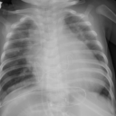
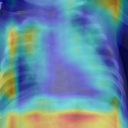
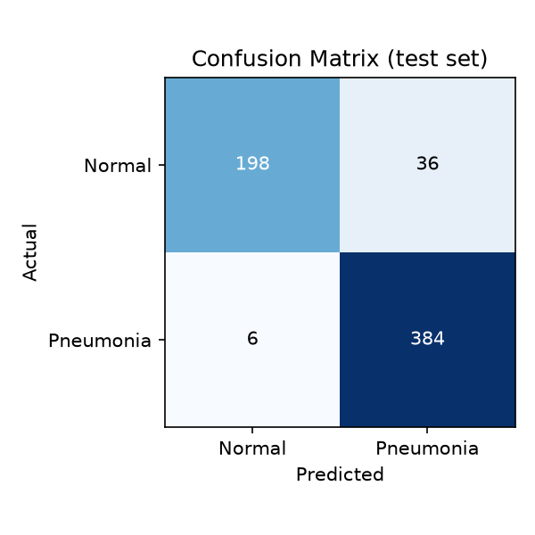
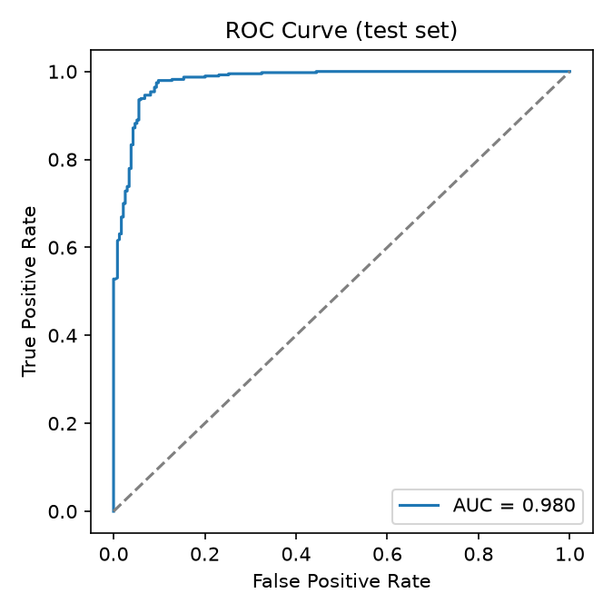

<div align="center">

# Chest X-Ray Pneumonia Screening Tool

**A CNN that reads chest X-rays, explains itself with Grad-CAM, and ships as a working dashboard — not just a training script.**

[](https://www.python.org/)
[](https://www.tensorflow.org/)
[](https://streamlit.io/)
[](LICENSE)
[](#limitations--ethical-disclosure)

</div>

<br>

<table>
<tr>
<td width="50%" align="center"><b>Input</b><br></td>
<td width="50%" align="center"><b>Grad-CAM — where the model looked</b><br></td>
</tr>
</table>

<p align="center"><i>Real output from this repo's own trained model — predicted <b>Pneumonia</b> at 100% confidence.</i></p>

## Table of contents

- [Quick start](#quick-start)
- [What it does](#what-it-does)
- [Results](#results)
- [Dataset](#dataset)
- [Project structure](#project-structure)
- [Design decisions](#design-decisions-worth-noting)
- [Limitations / ethical disclosure](#limitations--ethical-disclosure)
- [Attribution](#attribution)

## Quick start

The trained model ships in this repo — no training, no waiting, just run it.

### Windows: one-click install

1. Download **[`AI-Pneumonia-Screening-Tool.zip`](../../releases/latest)** from the latest release — this is the whole app, everything's inside.
2. Extract it, then double-click **`setup_and_run.bat`** inside — **just this once.**

It checks for Python (installing it via `winget` if missing), installs the app to your PC, opens it in its own window (not a browser tab), and adds a **desktop shortcut**. Once it's done, delete the extracted folder — the real install lives elsewhere from here on. Every time after that, just use the Desktop shortcut: no terminal, no re-running setup, no browser address bar. It opens like any other installed app.

### Any OS: five commands

```bash
git clone https://github.com/Lavamaster99/ai-pneumonia-xray-classifier.git
cd ai-pneumonia-xray-classifier

python -m venv venv
venv\Scripts\activate          # Windows
source venv/bin/activate       # macOS / Linux

pip install -r requirements.txt
streamlit run app.py
```

No git? Click **`<> Code`** → **Download ZIP** at the top of this page instead.

Once it's running, click **Browse files** and try `examples/sample_pneumonia.png` or `examples/sample_normal.png` to see a real prediction immediately.

<details>
<summary><b>Stuck?</b> Common issues</summary>
<br>

- **"python is not recognized"** (Windows) — Python wasn't added to PATH during install; reinstall and tick that box, or use `py` instead of `python` above.
- **Port 8501 already in use** — another Streamlit app is running; close it, or run `streamlit run app.py --server.port 8502`.
- **Install is slow** — normal on first run; TensorFlow alone is ~500MB.

</details>

## What it does

| | |
|---|---|
| **CNN classifier** | An 8-conv-layer network (batch norm, dropout, light augmentation) trained on 128×128 grayscale chest X-rays, outputting a pneumonia probability. |
| **Grad-CAM heatmaps** | Every prediction shows *which pixels* the network actually attended to ([Selvaraju et al., 2017](https://arxiv.org/abs/1610.02391)) — the difference between a bare number and an inspectable result. |
| **Web dashboard** | Upload an image in `app.py` and see the prediction, confidence, heatmap, and the model's own validated stats side by side. |

## Results

Test set, 624 held-out images (`reports/metrics.json`):

| Metric | Value |
|---|---|
| Accuracy | **93.3%** |
| Precision | 91.4% |
| Sensitivity (recall) | **98.5%** |
| AUC | 0.980 |
| False-negative rate | **1.5%** (6 of 390 pneumonia cases missed) |
| False-positive rate | 15.4% (36 of 234 normal cases flagged) |

<table>
<tr>
<td align="center"></td>
<td align="center"></td>
</tr>
</table>

The false-negative rate is reported on its own, separately from accuracy, because in a screening context a missed pneumonia case is a qualitatively worse error than a false alarm — accuracy alone would hide that.

**A real bug caught during verification, not hidden:** the first Grad-CAM pass returned nearly blank heatmaps on confident predictions. Root cause — gradients were computed against the post-sigmoid probability, which saturates near 0/1 and kills the gradient for exactly the most confident cases, compounded by a normalization epsilon larger than the signal itself. Fixed by differentiating against the recovered pre-sigmoid logit and switching to `divide_no_nan`. See `gradcam.py` for the fix, with the reasoning left in as a comment.

## Dataset

[PneumoniaMNIST](https://medmnist.com/) (MedMNIST v2 benchmark), sourced from Kermany et al.'s pediatric chest X-ray collection (Guangzhou Women and Children's Medical Center). **5,856 images, CC BY 4.0**, downloads automatically — no Kaggle account or manual wrangling.

Split: 4,708 train / 524 validation / 624 test. Class-imbalanced (~3:1 pneumonia:normal), handled with class weighting rather than duplicating images.

## Project structure

```
setup_and_run.bat  # first-time Windows setup: installs everything, creates a desktop shortcut
run.bat            # lightweight launcher used by that shortcut for every run after the first
train_model.py     # builds, trains, and evaluates the CNN; writes model + reports
gradcam.py         # Grad-CAM heatmap implementation
app.py             # Streamlit dashboard: upload -> prediction -> heatmap
smoke_test.py       # end-to-end pipeline sanity check
requirements.txt
model/             # trained model -- already committed, no training needed
reports/           # metrics.json + PNG plots -- already committed
examples/          # sample X-rays + their Grad-CAM outputs, for instant testing
data/              # cached dataset download (only appears if you retrain)
```

<details>
<summary><b>Retraining from scratch</b> (optional — not needed to use the app)</summary>
<br>

```bash
python train_model.py    # ~10-20 min on a laptop CPU, downloads PneumoniaMNIST automatically
```

Overwrites `model/pneumonia_cnn.keras` and `reports/metrics.json`. Results will vary slightly from the numbers above since training isn't perfectly deterministic.

</details>

## Design decisions worth noting

- **128×128 resolution**, not the raw 28×28 MedMNIST default: large enough for the Grad-CAM overlay to be visually meaningful on real anatomy, small enough to train in minutes on a CPU.
- **Class weighting over oversampling**: avoids duplicating minority-class images, which would inflate apparent performance without adding information.
- **Global average pooling instead of a large Dense head**: keeps the parameter count low (~300K) to reduce overfitting on ~4.7K training images, and keeps the final conv feature maps spatial — required for Grad-CAM to localize anything.
- **Explicit false-negative rate reporting**: a missed-pneumonia case has a much higher real-world cost than a false alarm — the kind of metric choice clinical ML systems are actually evaluated on.

## Limitations / ethical disclosure

This is an educational/portfolio project, **not a validated clinical tool**. PneumoniaMNIST is a pediatric-only, single-institution, single-imaging-protocol dataset; a model trained on it will not generalize reliably to adult patients, different X-ray machines, or different patient populations without further validation. The app itself includes an explicit "not a medical device" warning for this reason — no output from this tool should ever inform a real medical decision.

## Attribution

- **Dataset:** Yang et al., *MedMNIST v2* (2023); original imagery from Kermany et al., *Cell* (2018), Guangzhou Women and Children's Medical Center. CC BY 4.0.
- **Method:** Selvaraju et al., *Grad-CAM: Visual Explanations from Deep Networks via Gradient-based Localization*, ICCV 2017.
- **License:** [MIT](LICENSE)
