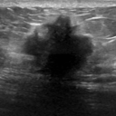
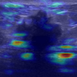
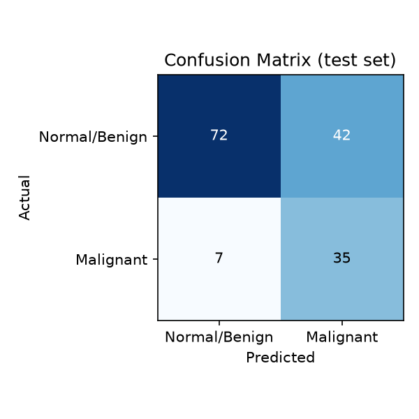
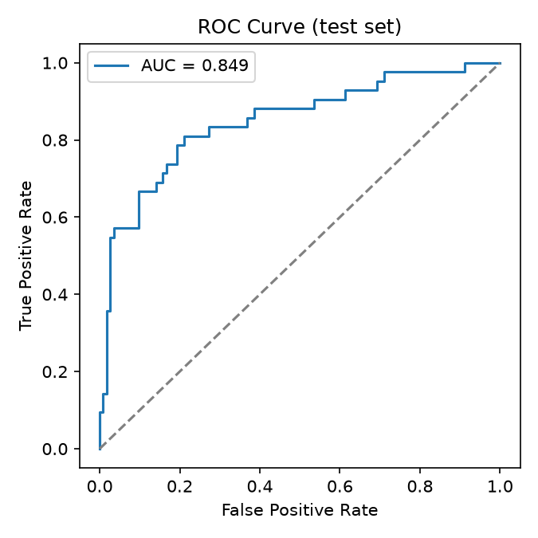
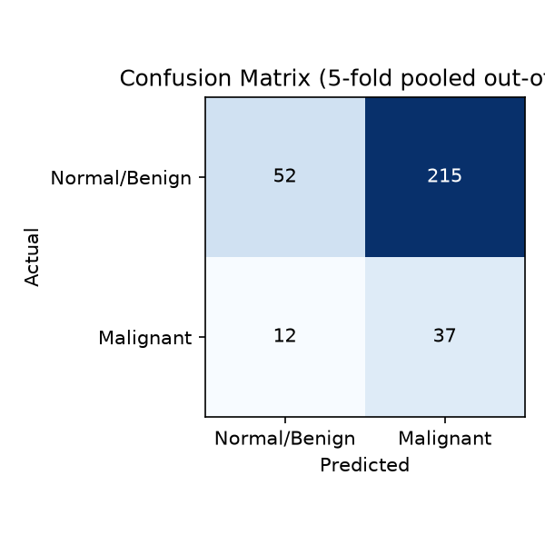
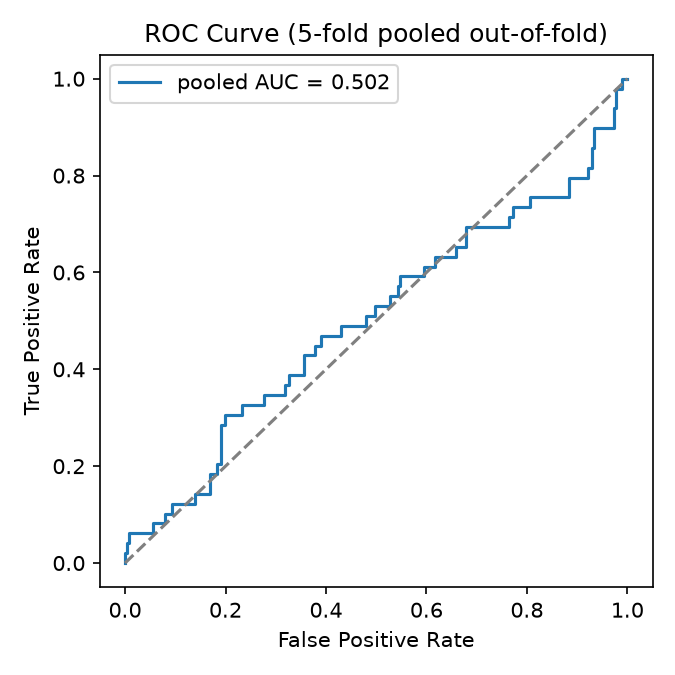

<div align="center">

# Medical Imaging Screening Tool

**Three CNNs, one dashboard: chest X-ray pneumonia, breast ultrasound malignancy, and mammogram malignancy screening, each explaining itself with Grad-CAM — not just a training script.**

[](https://www.python.org/)
[](https://www.tensorflow.org/)
[](https://streamlit.io/)
[](LICENSE)
[](#limitations--ethical-disclosure)

</div>

<br>

<table>
<tr>
<td width="50%" align="center"><b>Chest X-ray input</b><br></td>
<td width="50%" align="center"><b>Grad-CAM — where it looked</b><br></td>
</tr>
<tr>
<td width="50%" align="center"><b>Breast ultrasound input</b><br></td>
<td width="50%" align="center"><b>Grad-CAM — where it looked</b><br></td>
</tr>
</table>

<p align="center"><i>Real output from this repo's own trained models — pneumonia predicted <b>Pneumonia</b> at 100% confidence; the ultrasound sample predicted <b>Malignant</b>.</i></p>

## Table of contents

- [Quick start](#quick-start)
- [What it does](#what-it-does)
- [Results](#results)
- [Datasets](#datasets)
- [Project structure](#project-structure)
- [Design decisions](#design-decisions-worth-noting)
- [Limitations / ethical disclosure](#limitations--ethical-disclosure)
- [Attribution](#attribution)

## Quick start

All three trained models ship in this repo — no training, no waiting, just run it.

### One-click install

1. Download **[`Medical-Imaging-Screening-Tool.zip`](../../releases/latest)** from the latest release — this is the whole app, everything's inside.
2. Extract it wherever you'd like it to live, then run the setup script for your OS from inside that folder — **just this once.**

| OS | Run this |
|---|---|
| Windows | Double-click **`setup_and_run.bat`** |
| macOS | Double-click **`setup_and_run.sh`** in Terminal, or run `./setup_and_run.sh` (first time: `chmod +x setup_and_run.sh` if it won't execute) |
| Linux | Run `./setup_and_run.sh` in a terminal (`chmod +x setup_and_run.sh` first if needed) |

It checks for Python (installing it via `winget` on Windows if missing; on macOS/Linux it points you at Homebrew or your package manager instead), sets up an isolated environment right there in that folder, and opens the app. **Keep the folder** — everything lives in it, nothing is installed elsewhere and nothing is added to your Desktop or Start Menu. Next time, just run `run.bat` (Windows) or `run.sh` (macOS/Linux) from that same folder to open the app again — setup only needs to happen once.

### Any OS: manual setup

```bash
git clone https://github.com/Lavamaster99/ai-pneumonia-xray-classifier.git
cd ai-pneumonia-xray-classifier

python -m venv venv
venv\Scripts\activate          # Windows
source venv/bin/activate       # macOS / Linux

pip install -r requirements.txt
streamlit run app.py
```

No git? Click **`<> Code`** → **Download ZIP** at the top of this page instead.

Once it's running, use the switch at the top to pick a mode, then try the matching sample: `examples/sample_pneumonia.png` / `sample_normal.png` for chest X-ray, `examples/sample_benign.png` / `sample_malignant.png` for breast ultrasound, `examples/sample_mammo_normal.png` / `sample_mammo_malignant.png` for mammogram.

<details>
<summary><b>Stuck?</b> Common issues</summary>
<br>

- **"python is not recognized"** (Windows) — Python wasn't added to PATH during install; reinstall and tick that box, or use `py` instead of `python` above.
- **macOS says the script is from an "unidentified developer"** — right-click the script → Open → confirm. Only needed the first time; it's an unsigned script, not a bug.
- **Port 8501 already in use** — another Streamlit app is running; close it, or run `streamlit run app.py --server.port 8502`.
- **Install is slow** — normal on first run; TensorFlow alone is ~500MB.

</details>

## What it does

| | |
|---|---|
| **Three CNN classifiers, one dashboard** | A mode switch at the top swaps between chest X-ray pneumonia, breast ultrasound malignancy, and mammogram malignancy — each with its own network, metrics, and upload flow, sharing one interface. |
| **Grad-CAM heatmaps** | Every prediction, in any mode, shows *which pixels* the network actually attended to ([Selvaraju et al., 2017](https://arxiv.org/abs/1610.02391)) — the difference between a bare number and an inspectable result. |
| **Web dashboard** | Upload an image in `app.py` and see the prediction, confidence, heatmap, and the active model's own validated stats side by side. |

## Results

### Chest X-ray — pneumonia

Test set, 624 held-out images (`reports/metrics.json`):

| Metric | Value |
|---|---|
| Accuracy | **93.3%** |
| Precision | 91.4% |
| Sensitivity (recall) | **98.5%** |
| AUC | 0.980 |
| False-negative rate | **1.5%** (6 of 390 pneumonia cases missed) |
| False-positive rate | 15.4% (36 of 234 normal cases flagged) |

<table>
<tr>
<td align="center"></td>
<td align="center"></td>
</tr>
</table>

The false-negative rate is reported on its own, separately from accuracy, because in a screening context a missed pneumonia case is a qualitatively worse error than a false alarm — accuracy alone would hide that.

**A real bug caught during verification, not hidden:** the first Grad-CAM pass returned nearly blank heatmaps on confident predictions. Root cause — gradients were computed against the post-sigmoid probability, which saturates near 0/1 and kills the gradient for exactly the most confident cases, compounded by a normalization epsilon larger than the signal itself. Fixed by differentiating against the recovered pre-sigmoid logit and switching to `divide_no_nan`. See `gradcam.py` for the fix, with the reasoning left in as a comment.

### Breast ultrasound — malignancy

Test set, 156 held-out images (`reports/breast_metrics.json`):

| Metric | Value |
|---|---|
| Accuracy | 68.6% |
| Precision | 45.5% |
| Sensitivity (recall) | 83.3% |
| AUC | 0.849 |
| False-negative rate | 16.7% (7 of 42 malignant cases missed) |
| False-positive rate | 36.8% (42 of 114 normal/benign cases flagged) |

<table>
<tr>
<td align="center"></td>
<td align="center"></td>
</tr>
</table>

Reported as-is, not rounded up: BreastMNIST has 780 images total against PneumoniaMNIST's 5,856, and it shows. This model is deliberately kept in the same app as the stronger pneumonia one to be honest about that gap side by side, rather than only shipping the result that looks good. See [Limitations](#limitations--ethical-disclosure).

**A real bug caught during verification, not hidden:** `medmnist.INFO` was checked directly rather than assumed to share the pneumonia project's label convention — good thing, since BreastMNIST's native labels are the *opposite* (`0` = malignant, `1` = normal/benign). Flipped in `train_breast_model.py` so `1` = malignant consistently across this codebase, matching the pneumonia model's "positive = the thing you don't want to miss" convention.

### Mammogram — malignancy

**This one doesn't work well enough to give a real prediction, and the app says so instead of pretending otherwise.**

5-fold cross-validated whole-image performance (`reports/mammography_metrics.json`), each of the 316 usable images scored only by a fold that never trained on it:

| Metric | Value |
|---|---|
| Accuracy | 16.5% ± 0.7% |
| Sensitivity (recall) | 98.0% ± 4.0% |
| AUC | **0.489 ± 0.057** |
| False-negative rate | 2.0% ± 4.0% |
| False-positive rate | 98.5% ± 0.7% |

<table>
<tr>
<td align="center"></td>
<td align="center"></td>
</tr>
</table>

An AUC of 0.489 is statistically indistinguishable from a coin flip (0.5), and the tight ± 0.057 std across folds says this isn't noise from an unlucky split -- it's a reproducible finding that whole-image malignancy prediction doesn't work here. The recall/FNR numbers look great in isolation, but that's the model predicting almost everything malignant (98.5% false-positive rate), not genuine sensitivity. **`app.py` reflects this honestly**: uploading a mammogram still runs the real sliding-window scan and shows a real Grad-CAM overlay on the region it focused on, but no confidence number or verdict is shown for this mode -- see the notice the app displays instead.

What does work: the underlying model genuinely learns lesion-vs-tissue features (training AUC was consistently 0.90+ across all 5 folds). The gap is between that and turning a single best-guess window, out of hundreds scanned across a whole new image, into a trustworthy whole-image call -- with only 322 source images, MIAS doesn't supply enough signal for that last step, and no amount of threshold tuning fixes a missing signal.

**Three real problems caught during verification, not hidden:**

1. Whole-image resizing (the approach the other two models use) produced a model no better than a coin flip. MIAS images are full film scans up to ~5200×4000px; resizing to 128×128 shrinks a lesion to a handful of pixels, far too little signal for a CNN to learn from with only ~50 positive examples. Fixed by training on lesion-centered crops instead (sized proportionally to each lesion's radius, from MIAS's own ground truth) and having `app.py` scan an uploaded mammogram in overlapping windows at inference time rather than resizing it whole. See `train_mammography_model.py`'s module docstring.
2. Scanning hundreds of overlapping windows and taking the single highest-scoring one as "the" prediction turned out to flag *every* test image as malignant — a classic multiple-comparisons problem: with enough windows scanned, even a good classifier will spuriously score at least one of them high, on any image. Fixed two ways: aggregating the top-5 windows' mean score instead of a bare max (a real lesion scores high across several overlapping neighboring windows, not just one), and recalibrating the decision threshold against that aggregate score's own distribution on held-out data, instead of assuming the 0.5 that made sense for a single isolated patch still applied. See `mammo_window.py`.
3. A single train/val/test split (like the other two models use) turned out to be too small to trust: whole-image AUC swung between 0.55 and 0.82 across otherwise-identical reruns, purely from which ~13 malignant images happened to land in the test fold. That range would have let a lucky run look like a working model. Switched to 5-fold cross-validation instead -- every image gets scored by a model that never trained on it, and the mean ± std above (0.489 ± 0.057) is what that instability was actually hiding: no real signal, reproducibly. See `train_mammography_model.py`'s `main()`.

## Datasets

| | Pneumonia | Breast ultrasound | Mammogram |
|---|---|---|---|
| Source | Kermany et al., pediatric chest X-rays (Guangzhou Women and Children's Medical Center) | Al-Dhabyani et al., breast ultrasound (Baheya Hospital, Cairo) | Suckling et al., MIAS database — digitized film mammograms (UK screening programme, early 1990s) |
| Size | 5,856 images | 780 images | 322 images |
| Split | 4,708 / 524 / 624 (train/val/test) | 546 / 78 / 156 | 5-fold cross-validated (~253 train / ~63 test per fold) |
| License | CC BY 4.0 | CC BY 4.0 | CC BY 2.0 UK |
| Class balance | ~3:1 pneumonia:normal, handled with class weighting | ~2.4:1 benign:malignant, handled with class weighting | ~5:1 normal/benign:malignant, handled with class weighting |

Pneumonia and breast ultrasound are both from [MedMNIST v2](https://medmnist.com/) and download automatically on first training run. MIAS is hosted by the [University of Cambridge's institutional repository](https://doi.org/10.17863/CAM.105113) and also downloads automatically (`train_mammography_model.py` fetches and extracts it if `data/mias/` isn't already populated) — no Kaggle account or manual wrangling for any of the three.

## Project structure

```
setup_and_run.bat        # first-time Windows setup: installs everything in place
setup_and_run.sh         # first-time macOS/Linux setup: same
run.bat / run.sh         # lightweight launchers for every run after the first
train_model.py           # builds, trains, and evaluates the pneumonia CNN; writes model + reports
train_breast_model.py    # same, for the breast ultrasound CNN
train_mammography_model.py  # same, for the mammogram CNN (lesion-patch training + whole-image eval)
gradcam.py                # Grad-CAM heatmap implementation, shared by all three models
mammo_window.py           # sliding-window scan + aggregation, shared by app.py and the mammography trainer
app.py                   # Streamlit dashboard: mode switch -> upload -> prediction -> heatmap
smoke_test.py             # end-to-end pipeline sanity check, all three models
requirements.txt
model/                   # all three trained models -- already committed, no training needed
reports/                 # metrics.json + breast_metrics.json + mammography_metrics.json + PNG plots
examples/                # sample images (all three modes) + their Grad-CAM outputs, for instant testing
data/                    # cached dataset downloads (only appears if you retrain)
```

<details>
<summary><b>Retraining from scratch</b> (optional — not needed to use the app)</summary>
<br>

```bash
python train_model.py               # pneumonia -- ~10-20 min on a laptop CPU
python train_breast_model.py        # breast ultrasound -- faster, much smaller dataset
python train_mammography_model.py   # mammogram -- downloads MIAS (~1.5GB) on first run
```

Each downloads its dataset automatically and overwrites the matching files in `model/` and `reports/`. Results will vary slightly from the numbers above since training isn't perfectly deterministic.

</details>

## Design decisions worth noting

- **One dashboard, not three apps**: the mode switch keeps all three screening tasks under one interface, one design system, one install — closer to how a real clinical screening tool would be packaged than three disconnected demos.
- **128×128 model input**, not the raw resolution of any source dataset: large enough for the Grad-CAM overlay to be visually meaningful on real anatomy, small enough to train in minutes on a CPU.
- **Class weighting over oversampling**: avoids duplicating minority-class images, which would inflate apparent performance without adding information.
- **Global average pooling instead of a large Dense head**: keeps the parameter count low to reduce overfitting on the smaller training sets, and keeps the final conv feature maps spatial — required for Grad-CAM to localize anything.
- **Explicit false-negative rate reporting**: a missed case has a much higher real-world cost than a false alarm in a screening context — the kind of metric choice clinical ML systems are actually evaluated on.
- **Transfer learning for mammography only**: the other two models train a small CNN from scratch, which works fine on their thousands of images; MIAS's ~300 lesion patches is too little for that, so the mammography model instead fine-tunes a frozen, ImageNet-pretrained MobileNetV2 backbone — the standard fix for a dataset this small, not used elsewhere in this repo because it isn't needed elsewhere.
- **The weaker models shipped anyway, and so did the one that doesn't work**: cutting breast ultrasound would have hidden a real, honest constraint (dataset size) instead of surfacing it, so it stayed. Mammography went further -- cross-validation showed it doesn't clear the bar for a real prediction at all, so `app.py` says exactly that instead of showing a number, rather than either hiding the whole attempt or dressing up a coin flip as a finding.

## Limitations / ethical disclosure

This is an educational/portfolio project, **not a validated clinical tool**, for any of the three models. `app.py` and the results above say so explicitly rather than only in fine print.

- **Pneumonia model:** PneumoniaMNIST is a pediatric-only, single-institution, single-imaging-protocol dataset; it will not generalize reliably to adult patients, different X-ray machines, or different patient populations without further validation.
- **Breast ultrasound model:** trained on only 780 images total — a fraction of what a clinically validated system would require. Its 68.6% accuracy and 45.5% precision reflect that directly; treat any single prediction from it as illustrative, not diagnostic.
- **Mammogram model:** doesn't report a prediction at all, by design -- see [Results](#results). Trained on 322 images of digitized film from an early-1990s UK screening programme, it does learn real lesion-vs-tissue features, but 5-fold cross-validation showed whole-image malignancy prediction from that many images isn't reliable (AUC 0.489 ± 0.057, statistically indistinguishable from chance). `app.py` still runs the real sliding-window scan and Grad-CAM for this mode, but shows an explicit notice instead of a confidence number.

No output from this tool should ever inform a real medical decision. If you or someone you know has a health concern, see a doctor — this tool cannot and should not replace that.

## Attribution

- **Pneumonia dataset:** Yang et al., *MedMNIST v2* (2023); original imagery from Kermany et al., *Cell* (2018), Guangzhou Women and Children's Medical Center. CC BY 4.0.
- **Breast ultrasound dataset:** Yang et al., *MedMNIST v2* (2023); original imagery from Al-Dhabyani et al., *Dataset of breast ultrasound images*, Data in Brief (2020), Baheya Hospital, Cairo. CC BY 4.0.
- **Mammogram dataset:** J Suckling et al. (1994), *The Mammographic Image Analysis Society Digital Mammogram Database*, Exerpta Medica, International Congress Series 1069, pp375-378. Hosted by the [University of Cambridge](https://doi.org/10.17863/CAM.105113). CC BY 2.0 UK.
- **Method:** Selvaraju et al., *Grad-CAM: Visual Explanations from Deep Networks via Gradient-based Localization*, ICCV 2017.
- **License:** [MIT](LICENSE)
